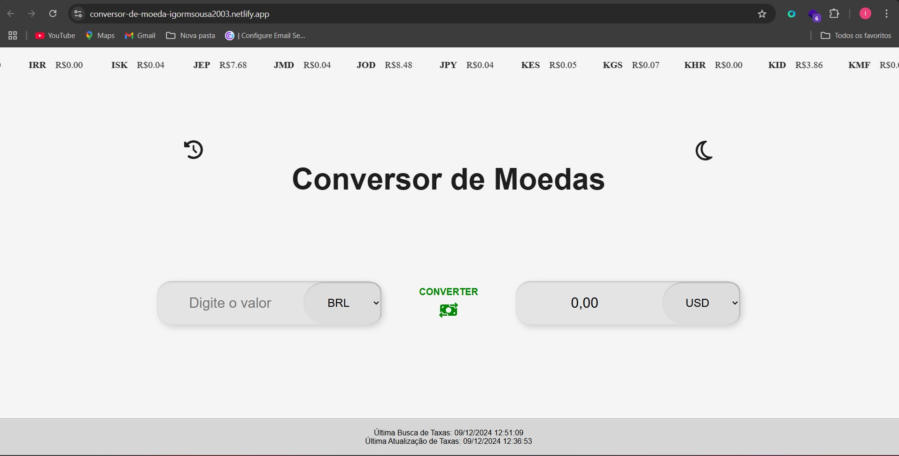
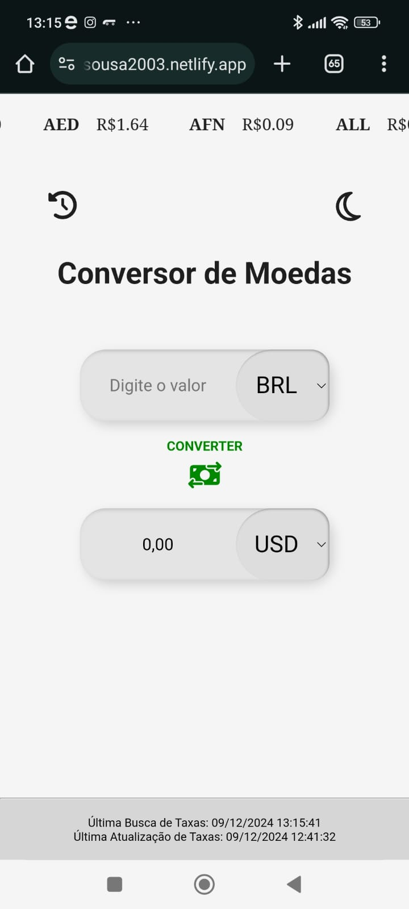
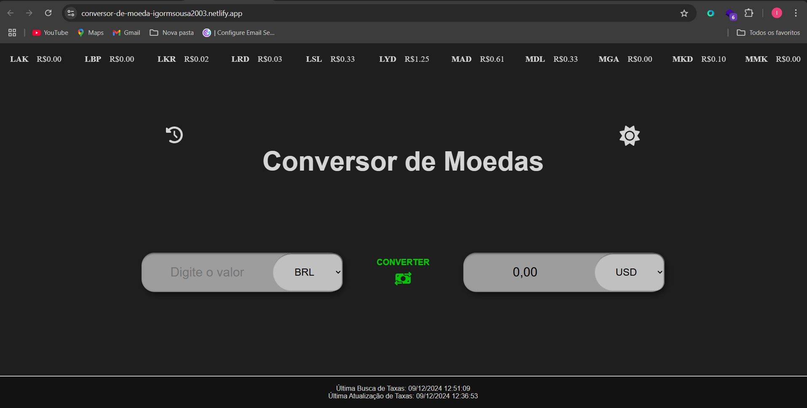

# 💱 Conversor de Moedas 💱

Um conversor de moedas construído com **React** e **Vite**, utilizando a API [exchangerate-api.com](https://www.exchangerate-api.com/) para obter taxas de câmbio atualizadas em tempo real. A aplicação permite ao usuário converter valores entre diferentes moedas com otimização de desempenho, incluindo **Lazy Loading** para melhorar o carregamento 🚀.

## Deploy 🚀

A aplicação está disponível no seguinte link:  
🔗 [Conversor de Moedas - Netlify](https://conversor-de-moeda-igormsousa2003.netlify.app/)

## Funcionalidades 📋

1. **Conversão de Moedas**: O usuário pode selecionar uma moeda de origem, uma moeda de destino, inserir um valor para converter e clicar no botão "Converter" para visualizar o cálculo da conversão.
2. **Atualização em Tempo Real**: As taxas de câmbio são atualizadas diariamente para garantir que os valores sejam precisos.
3. **Histórico de Conversão**: O usuário pode visualizar as últimas cinco conversões realizadas durante a sessão ao clicar no botão de histórico.
4. **Modo Noturno**: O usuário pode alterar o tema da página para escuro clicando no ícone de Lua 🌙.

## Imagens do Projeto 📸

  
  

  
  

## Informações Técnicas ⚙️

- **React & Vite**: A aplicação foi construída com React, utilizando o Vite para otimizar o processo de build.
- **API de Taxas de Câmbio**: Utilizamos a API pública da [exchangerate-api.com](https://www.exchangerate-api.com/) para obter taxas de câmbio atualizadas em tempo real.
- **Armazenamento em Cache**: Implementamos um mecanismo para armazenar as taxas de câmbio localmente usando `localStorage`, atualizando-as diariamente.
- **Desempenho e Tamanho de Build**:
  - A aplicação foi otimizada para produção.
  - **Lazy Loading**: Utilizamos lazy loading para módulos não essenciais, melhorando o desempenho de carregamento.
- **Estilo e Interatividade**: A aplicação foi estilizada utilizando **styled-components**.

## Estrutura do Projeto 📂

- **src/components**: Contém os componentes principais da aplicação (ex: formulários, botões, histórico).
- **src/context**: Contém o contexto global para o gerenciamento do estado e atualizações.
- **src/services**: Contém os serviços para integração com a API de taxas de câmbio.
- **src/styles**: Contém os arquivos de estilo, utilizando `styled-components`.

## Tecnologias Utilizadas 🛠️

- **React**: Biblioteca JavaScript para construção da interface de usuário.
- **Vite**: Ferramenta de bundling e build extremamente rápida para desenvolvimento.
- **Axios**: Cliente HTTP para fazer requisições à API de taxas de câmbio.
- **styled-components**: Para estilização dos componentes da aplicação.
- **exchangerate-api.com**: API de taxas de câmbio para obter as informações em tempo real.

---

Projeto desenvolvido por [Igor Moura](https://github.com/seu-usuario).
