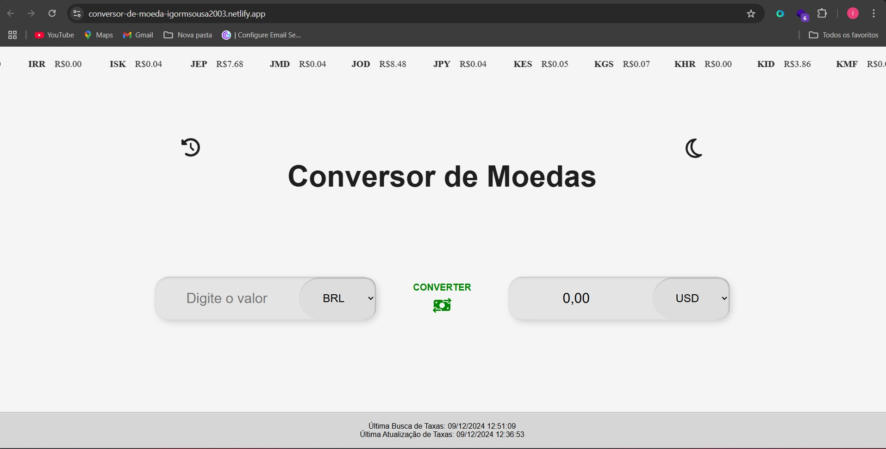
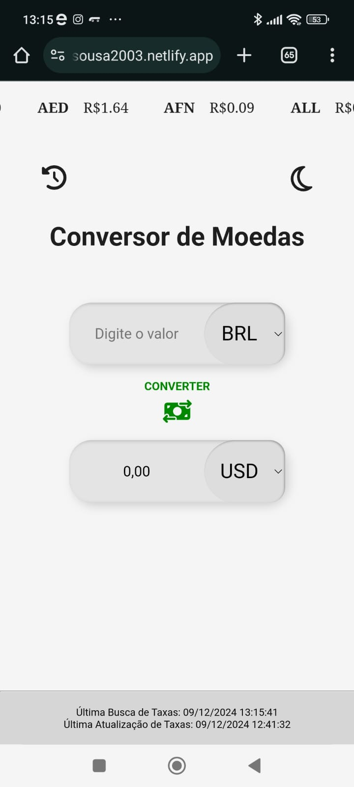

# 💱 Currency Converter 💱

A currency converter built with **React** and **Vite**, using the [exchangerate-api.com](https://www.exchangerate-api.com/) API to fetch real-time exchange rates. The application allows users to convert values between different currencies with performance optimizations, including **Lazy Loading** for faster load times 🚀.

## Deploy 🚀

The application is available at the following link:  
🔗 [Currency Converter - Netlify](https://conversor-de-moeda-igormsousa2003.netlify.app/)

## Features 📋

1. **Currency Conversion**: Users can select a source currency, a target currency, enter a value to convert, and click the "Convert" button to see the conversion calculation.
2. **Real-time Updates**: Exchange rates are updated daily to ensure accurate values.
3. **Conversion History**: Users can view the last five conversions performed during the session by clicking the history button.
4. **Night Mode**: Users can toggle the page theme to dark mode by clicking the Moon icon 🌙.

## Project Images 📸

  
  

  
  

## Technical Details ⚙️

- **React & Vite**: The application was built with React, using Vite to optimize the build process.
- **Exchange Rates API**: The application uses the public API from [exchangerate-api.com](https://www.exchangerate-api.com/) to fetch real-time exchange rates.
- **Cache Storage**: Implemented a mechanism to store exchange rates locally using `localStorage`, updating them daily.
- **Performance and Build Size**:
  - The application is optimized for production.
  - **Lazy Loading**: Lazy loading is used for non-essential modules to improve load performance.
- **Styling and Interactivity**: The application is styled using **styled-components**.

## Project Structure 📂

- **src/components**: Contains the application's main components (e.g., forms, buttons, history).
- **src/context**: Contains the global context for state management and updates.
- **src/services**: Contains the services for integration with the exchange rates API.
- **src/styles**: Contains the styling files, utilizing `styled-components`.

## Technologies Used 🛠️

- **React**: A JavaScript library for building user interfaces.
- **Vite**: A fast bundling and build tool for development.
- **Axios**: HTTP client to make requests to the exchange rates API.
- **styled-components**: For styling the application's components.
- **exchangerate-api.com**: Exchange rates API to fetch real-time information.

---

Project developed by [Igor Moura](https://github.com/IgorMouraS).
